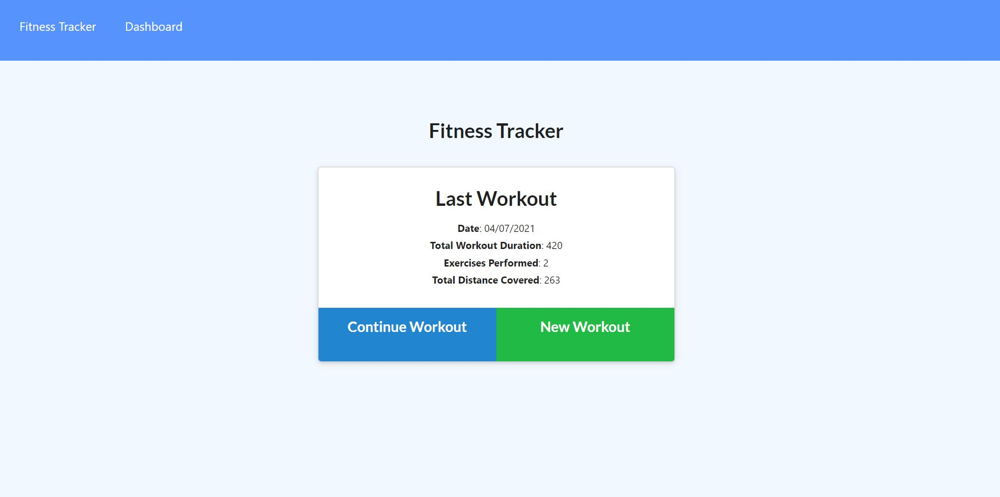
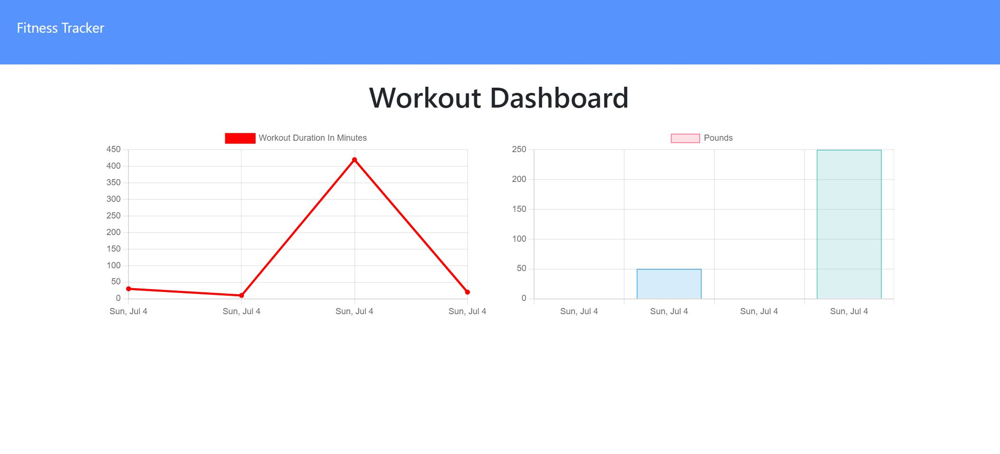

# Workout Tracker

In this assignment, I have created the back end of a workout tracker, having been giventhe code for the front end.

[Link to deployed app](https://workout-tracker-rw.herokuapp.com/)

## Table of Contents
* [Description](#description)
* [Installation](#installation)
* [Screenshot](#screenshot)
* [Contributions](#contributions)
* [Contact](#contact)

## Description

The app allows users to view create and track daily workouts. They are able to log multiple exercises in a workout on a given day. As well as being able to track the name, type, weight, sets, reps, and duration of exercise. If the exercise is a cardio exercise, users are able to track their distance traveled..

The backend functionality of the app comes from Node.js, Express, MongoDB and Mongoose.

## Installation 

* Run npm i to install all dependencies. 
* Run npm start to run the app locally.

## Screenshot

## Contributions

* Front end provided by Trilogy Education Services.
* Back end built by Ross White.

## Contact

* [Email](mailto:rosswhite@outlook.com)
* [LinkedIn](https://www.linkedin.com/in/ross-white-b4751814b/)
* [GitHub](https://github.com/Ross-White)

